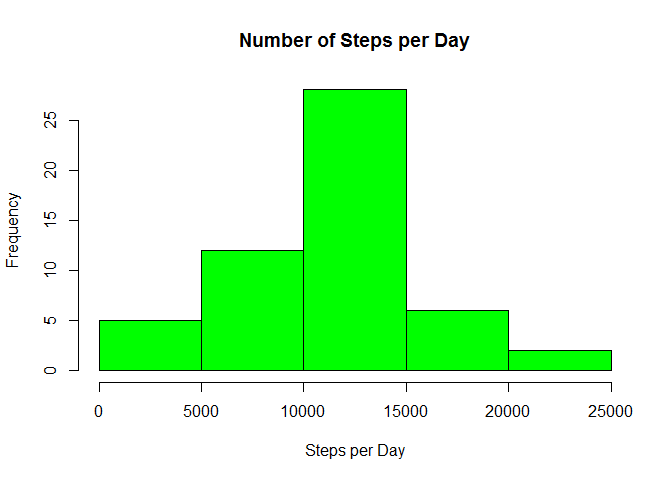
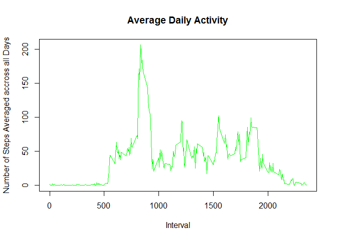
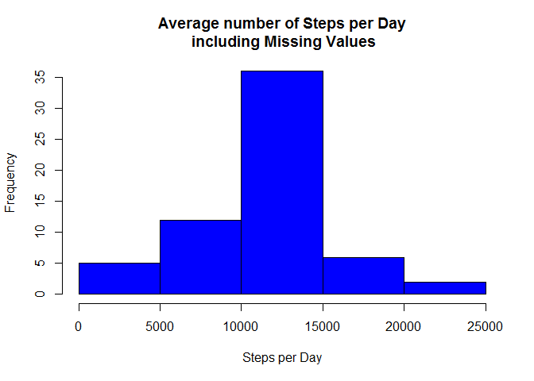

Reproducible Research: Peer Assessment 1
----------------------------------------

Loading and preprocessing the data
----------------------------------

1.  Load the data
2.  Process/transform the data (if necessary) into a format suitable for
    your analysis

We first here load the data after downloading it from the web link that
has been provided and extracted csv file, activity.csv, using
read.csv().

    data <- read.csv("activity.csv", sep=",", header = TRUE, stringsAsFactors = FALSE, na.strings = "NA")

What is mean total number of steps taken per day?
-------------------------------------------------

### For this part of the assignment, you can ignore the missing values in the dataset.

1.  Calculate the total number of steps taken per day

Use complete.cases function to extract all the NA values from the
dataset. Then, calculate the sum of steps (total number) for each day by
applying the tapply function with steps and date, calling the function
sum.

    data_n <- data[complete.cases(data),]
    total_step_day <- tapply(data_n$steps, data_n$date, sum, na.rm = TRUE)

1.  Plot histogram showing the steps and their frequency.

<!-- -->

    hist(total_step_day, col="green", xlab = "Steps per Day", main = "Number of Steps per Day")

1.  Calculate and report the mean and median of the total number of
    steps taken per day

<!-- -->

    mean(total_step_day)

    ## [1] 10766.19

    median(total_step_day)

    ## [1] 10765

The mean and median total number of steps per day are 10766 and 10765
steps respectively.

What is the average daily activity pattern?
-------------------------------------------

1.  Make a time series plot (i.e. type = "l") of the 5-minute
    interval (x-axis) and the average number of steps taken, averaged
    across all days (y-axis)

<!-- -->

    data_n <- data[complete.cases(data),]
    time_series <- tapply(data_n$steps, data_n$interval, mean, na.rm = TRUE)

Plot the time series

    plot(names(time_series), time_series, type = "l", xlab = "Interval", ylab = "Number of Steps Averaged accross all Days", main = "Average Daily Activity", col = "green")

Imputing missing values
-----------------------

1.  Calculate and report the total number of missing values in the
    dataset (i.e. the total number of rows with NAs)

Use the complete.cases function to extract the NA values from the
dataset.

    num_na <- sum(!(complete.cases(data)))
    num_na

    ## [1] 2304

The total number of missing values in the dataset is 2304.

1.  Devise a strategy for filling in all of the missing values in
    the dataset. The strategy does not need to be sophisticated. For
    example, you could use the mean/median for that day, or the mean for
    that 5-minute interval, etc.

2.  Create a new dataset that is equal to the original dataset but with
    the missing data filled in.

Assign each NA value the average number of steps calculated through all
the other steps values for the same interval for all days. Create new
dataset within the for-loop call.

    data_new <- data
    for (i in 1:nrow(data_new)){
        if (is.na(data_new$steps[i])){
            data_new$steps[i] <- mean(data_new$steps[data_new$interval == data_new$interval[i]], na.rm=TRUE)
        }
    }

1.  Make a histogram of the total number of steps taken each day and
    Calculate and report the mean and median total number of steps taken
    per day. Do these values differ from the estimates from the first
    part of the assignment? What is the impact of imputing missing data
    on the estimates of the total daily number of steps?

<!-- -->

    total_step_day2 <- tapply(data_new$steps, data_new$date, sum)
    hist(total_step_day2, col = "blue",xlab = "Steps per Day", main = "Average number of Steps per Day\n including Missing Values")

Calculate the mean and the median of this set.

    mean(total_step_day2)

    ## [1] 10766.19

    median(total_step_day2)

    ## [1] 10766.19

Due to data imputation, the means remain same and a slight change in
median value.

Are there differences in activity patterns between weekdays and weekends?
-------------------------------------------------------------------------

1.  Create a new factor variable in the dataset with two levels -
    "weekday" and "weekend" indicating whether a given date is a weekday
    or weekend day.

Assign the test value (weekday/weekend) to the variable, w, and create w
inside the dataset and set it to factor.

    w <- weekdays(strptime(data_new$date, format = "%Y-%m-%d"))
    for (i in 1:length(w)){
        if (w[i] == "Saturday" | w[i] == "Sunday"){
            w[i] <- "weekend"
        } 
        else {
            w[i] <- "weekday"
        }
    }
    w <- as.factor(w)
    data_new$w <- w

1.  Make a panel plot containing a time series plot (i.e. type = "l") of
    the 5-minute interval (x-axis) and the average number of steps
    taken, averaged across all weekday days or weekend days (y-axis).
    See the README file in the GitHub repository to see an example of
    what this plot should look like using simulated data.

Create a new data set with function aggregate with the w variable.

    data_fin <- aggregate(steps ~ interval + w, data = data_new, mean)

    library(lattice)

    xyplot(steps ~ interval | w, data = data_fin, type = "l", layout = c(1, 2), xlab = "Interval", ylab = "Number of Steps")

